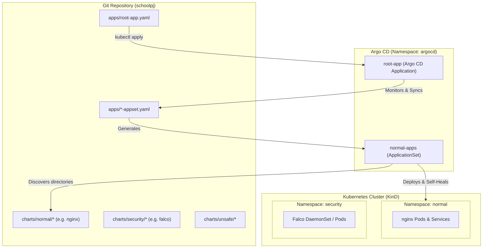

# School Project: GitOps with Argo CD & Kubernetes (KinD)

A declarative GitOps repository demonstrating the **App-of-Apps** and **ApplicationSet** patterns with [Argo CD](https://argo-cd.readthedocs.io/) on a local [KinD (Kubernetes in Docker)](https://kind.sigs.k8s.io/) cluster.

---

## 📖 Overview

This repository automates the deployment and lifecycle management of Kubernetes applications using Git as the single source of truth.

- **Root Application Pattern**: A single root application (`apps/root-app.yaml`) bootstraps and monitors the `apps/` directory.
- **Dynamic ApplicationSets**: The `normal-apps` ApplicationSet automatically detects any Helm chart folder added to `charts/normal/` and deploys it into its designated namespace (`normal`).
- **Separation of Concerns**: Workloads are categorized across `normal` (standard apps), `security` (monitoring/runtime inspection like Falco), and `unsafe` (security testing / vulnerable apps).

---

## 🏗️ Architecture



---

## 📁 Repository Structure

```text
.
├── apps/
│   ├── root-app.yaml           # Root Argo CD Application watching apps/
│   └── normal-appset.yaml      # ApplicationSet auto-discovering charts/normal/*
├── charts/
│   ├── normal/                 # Standard application workloads
│   │   └── nginx/              # NGINX chart wrapper (Bitnami dependency)
│   │       ├── Chart.yaml
│   │       └── values.yaml
│   ├── security/               # Security & monitoring tools
│   │   └── falco/              # Falco runtime security chart
│   │       ├── Chart.yaml
│   │       └── values.yaml
│   └── unsafe/                 # Intentionally vulnerable or high-privilege test workloads
└── readme.md                   # Project documentation
```

---

## 🚀 Getting Started

### 1. Prerequisites

Make sure the following CLI tools are installed on your machine:

- [Docker](https://docs.docker.com/get-docker/)
- [KinD](https://kind.sigs.k8s.io/docs/user/quick-start/#installation)
- [kubectl](https://kubernetes.io/docs/tasks/tools/)
- [Helm](https://helm.sh/docs/intro/install/)
- [Argo CD CLI](https://argo-cd.readthedocs.io/en/stable/cli_installation/) *(optional)*

---

### 2. Create the KinD Cluster

Create a local Kubernetes cluster using KinD:

```bash
kind create cluster --name schoolpj
```

Verify your cluster connection:

```bash
kubectl cluster-info --context kind-schoolpj
```

---

### 3. Install Argo CD

1. Create the `argocd` namespace:
   ```bash
   kubectl create namespace argocd
   ```

2. Install Argo CD manifests:
   ```bash
   kubectl apply -n argocd -f https://raw.githubusercontent.com/argoproj/argo-cd/stable/manifests/install.yaml
   ```

3. Wait until all Argo CD pods are running:
   ```bash
   kubectl wait --for=condition=ready pod --all -n argocd --timeout=300s
   ```

---

### 4. Access the Argo CD Web UI

1. Port-forward the Argo CD server locally:
   ```bash
   kubectl port-forward svc/argocd-server -n argocd 8080:443
   ```

2. Open your browser and navigate to: `https://localhost:8080`

3. Retrieve the initial admin password:
   ```bash
   kubectl -n argocd get secret argocd-initial-admin-secret -o jsonpath="{.data.password}" | base64 -d; echo
   ```
   - **Username**: `admin`
   - **Password**: *(output from command above)*

---

### 5. Bootstrap the GitOps Engine

Bootstrap the entire stack by applying the root application:

```bash
kubectl apply -f apps/root-app.yaml
```

Once applied:
1. `root-app` starts tracking the `apps/` directory in this repository.
2. It automatically deploys `apps/normal-appset.yaml`.
3. The `normal-apps` ApplicationSet discovers all charts under `charts/normal/*` and automatically provisions them into the `normal` namespace.

---

## 🔄 Adding New Applications

Thanks to the Git generator configured in `apps/normal-appset.yaml`, onboarding a new chart is completely automated:

1. Create a new Helm chart directory inside `charts/normal/<app-name>`:
   ```bash
   mkdir -p charts/normal/my-app
   ```
2. Add your `Chart.yaml`, `values.yaml`, and templates or dependencies.
3. Commit and push your changes:
   ```bash
   git add charts/normal/my-app
   git commit -m "feat: add my-app"
   git push origin main
   ```
4. Argo CD will automatically detect the new folder, create a corresponding `Application` named `my-app`, and deploy it to the `normal` namespace.

---

## ⚙️ Sync Policies & Features

- **Automated Sync**: Changes pushed to `main` are automatically synchronized to the cluster.
- **Prune**: Deleted resources in Git are pruned from the cluster automatically (`prune: true`).
- **Self-Healing**: Manual out-of-band drifts on the cluster are automatically corrected (`selfHeal: true`).
- **Automatic Namespace Creation**: Applications automatically create their target namespace if it does not yet exist (`CreateNamespace=true`).

---

## 🛠️ Useful Commands

| Action | Command |
|---|---|
| View Argo CD Applications | `kubectl get applications -n argocd` |
| View ApplicationSets | `kubectl get applicationsets -n argocd` |
| View Pods in `normal` namespace | `kubectl get pods -n normal` |
| View Argo CD sync status | `argocd app list` |
| Manually trigger sync for root app | `kubectl annotate app root-app -n argocd argocd.argoproj.io/refresh=hard` |
| Delete the KinD cluster | `kind delete cluster --name schoolpj` |